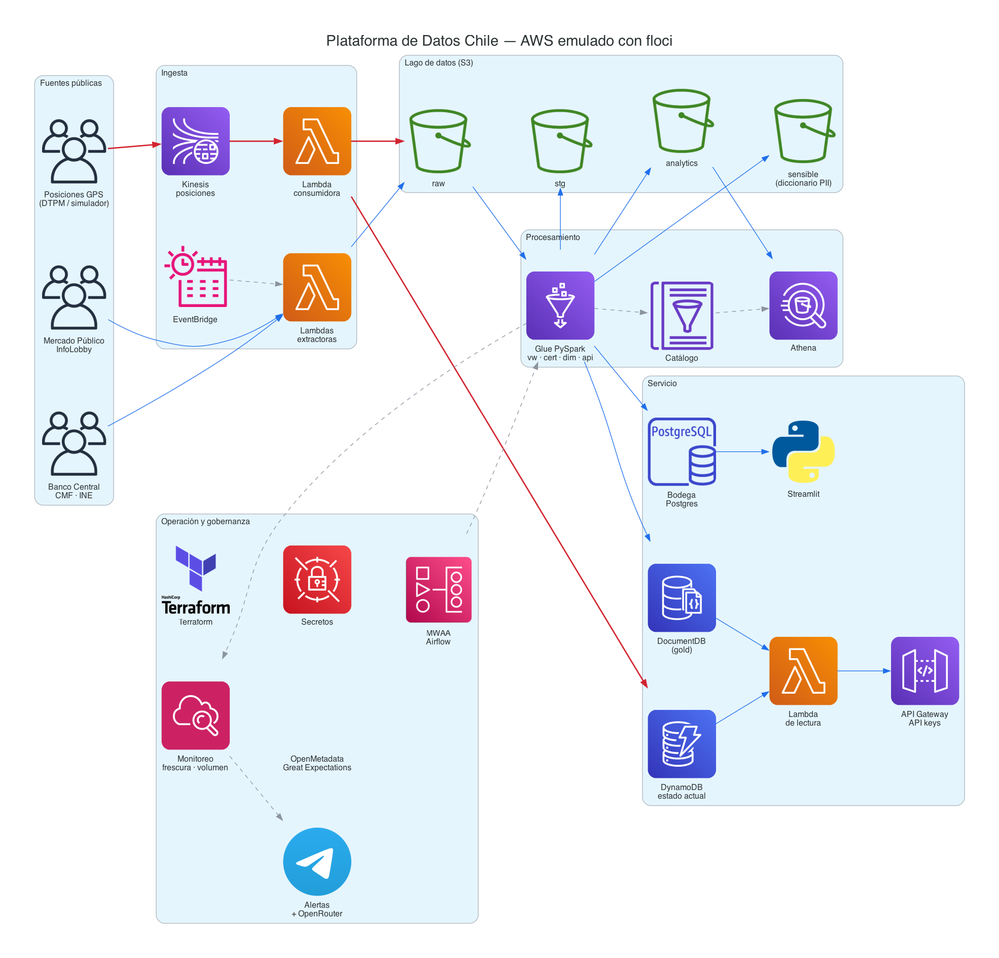

# Plataforma de Datos Chile

Plataforma de datos de punta a punta sobre datos públicos chilenos, construida con servicios de AWS
emulados localmente con [floci](https://github.com/floci-io/floci): ingesta batch y en tiempo real,
lago en capas, jobs de Glue, bodega dimensional, APIs de datos, orquestación, monitoreo y gobernanza.



## Dominios

| Dominio | Pregunta |
|---|---|
| Compras públicas (batch) | ¿Qué organismos concentran compras en pocos proveedores o en trato directo? |
| Transporte Santiago (tiempo real) | ¿Cuánto se desvía el servicio de buses del programado? |
| Economía regional (analítica) | ¿Cómo se mueven empleo y precios por región frente al país? |

## Requisitos

Docker, Terraform, Python 3.11, AWS CLI, Graphviz y `uv`.

## Levantar el entorno

```bash
cp .env.example .env                       # ticket de Mercado Público, clave de seudonimización y claves de Postgres
docker compose up -d                       # floci en localhost:4566
python3.11 -m venv .venv && .venv/bin/pip install -r requirements-dev.txt
set -a; source .env; set +a
scripts/empaquetar_lambda.sh api_compras
export TF_VAR_postgres_password=$POSTGRES_PASSWORD TF_VAR_clave_seudonimo=$CLAVE_SEUDONIMO TF_VAR_docdb_password=$DOCDB_PASSWORD
cd infra/terraform && terraform init && terraform apply && cd -
```

## Primer pipeline

```bash
.venv/bin/python scripts/extraer_ordenes_dia.py --fecha 2026-09-26 --limite 60
scripts/glue_local.sh pdc_vw_ordenes_compra --fechaParticion 2026-09-26 \
  --bucketOrigen pdc-raw --bucketDestino pdc-analytics --bucketSensible pdc-sensible \
  --baseDatos pdc --secretoSeudonimo pdc/seudonimo
```

## Bodega

```bash
C=$(docker ps --format '{{.Names}}' | grep floci-rds)
docker exec -i $C psql -U pdc_admin -d bodega < sql/bodega/01_ddl.sql
MEMORIA_DRIVER=4g scripts/glue_local.sh pdc_dim_compras --fechaParticion 2026-09 \
  --bucketOrigen pdc-analytics --secretoBodega pdc/bodega \
  --rutaSql s3://pdc-glue-assets/sql/bodega --hostBodega floci
```

## Orquestación

`docker compose up -d` levanta floci, el emulador de ejecuciones de Glue (`glue-jobs`, puerto 4567) y el
reenvío a la interfaz de Airflow (`airflow-ui`, puerto 8080). Terraform crea el entorno MWAA con el DAG
`dag_compras_diario`: espera a que raw tenga el archivo del día y corre los jobs de Glue por mes.

```bash
open http://localhost:8080                 # usuario admin
docker exec $(docker ps --format '{{.Names}}' | grep pdc-airflow-airflow) printenv _AIRFLOW_WWW_USER_PASSWORD
scripts/recrear_mwaa.sh                    # después de reiniciar floci
scripts/publicar_dags.sh                   # después de cambiar un DAG
```

## API de datos

```bash
scripts/empaquetar_lambda.sh api_compras   # antes de terraform apply
scripts/crear_api_key.sh                    # guarda API_KEY_DEMO en .env
set -a; source .env; set +a
URL=$(terraform -chdir=infra/terraform output -raw url_api)
curl -H "x-api-key: $API_KEY_DEMO" "$URL/compras/organismos/7248/resumen?mes=2026-09"
curl -H "x-api-key: $API_KEY_DEMO" "$URL/compras/alertas/concentracion?hhi_min=5000&limite=10"
```

## MCP

`.mcp.json` define dos servidores de solo lectura: `aws-floci` (API de AWS contra floci) y `postgres-bodega`.
El segundo toma la clave de la variable `POSTGRES_LECTOR_PASSWORD`, así que el cliente debe iniciarse con el `.env` cargado (`set -a; source .env; set +a`).

## Estructura

```
airflow/dags/       DAGs de MWAA
docs/diagramas/     diagramas como código (mingrammer/diagrams)
emuladores/         servicios locales que completan lo que floci no ejecuta
glue/jobs/          un script por job de Glue
infra/terraform/    infraestructura contra floci
lambdas/            código de las Lambdas
scripts/            utilitarios locales (extracción, Glue local, prueba de MCP)
sql/bodega/         DDL, carga y roles de la bodega
spec/               documentación del proyecto (vault de Obsidian)
utils/              código compartido por jobs, Lambdas y DAGs
```

## Documentación

Arquitectura, decisiones (ADRs), dominios y fuentes en [`spec/`](spec/README.md).
